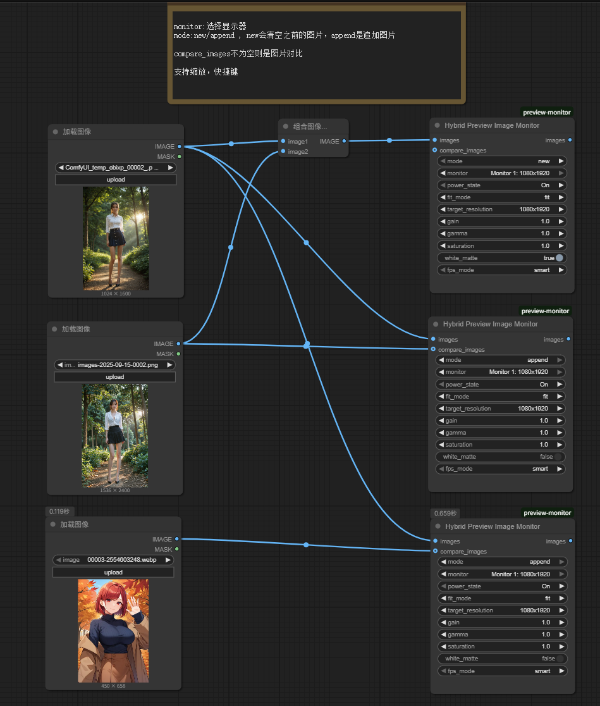

# ComfyUI Preview Monitor

一个强大的ComfyUI自定义节点，提供多种图片预览和监控功能，支持Pygame、Web和混合模式显示。

## 📸 功能展示

### 混合预览监控器界面


### 图片比较模式


## ✨ 主要特性

- 🖼️ **多模式显示**: 支持单图、多图、比较、幻灯片模式
- 🖥️ **多显示器支持**: 自动检测并支持多个显示器
- 🔄 **智能队列管理**: new/append模式，自动去重，显示最新图片
- 🎮 **丰富交互**: 键盘快捷键、鼠标操作、缩放平移
- ⚡ **高性能**: 优化的图片处理和显示性能
- 🔧 **灵活配置**: 支持图片增益、伽马、饱和度调整

## 🚀 功能特性

### 核心功能
- **多显示器支持**: 自动检测并支持多个显示器
- **多种显示模式**: 单图、多图、比较、幻灯片模式
- **实时预览**: 支持实时图片更新和监控
- **高性能**: 优化的图片处理和显示性能
- **灵活控制**: 丰富的键盘和鼠标控制选项
- **智能队列管理**: 支持new/append模式，自动去重，显示最新图片

### 显示模式
- **Single**: 单张图片显示
- **Multi**: 多张图片手动切换
- **Comparison**: 图片对比模式（鼠标控制分割线）
- **Slideshow**: 幻灯片模式（手动控制）

### 交互控制
- **键盘快捷键**: 专业的Ctrl+组合键控制
- **鼠标操作**: 缩放、平移、拖拽
- **实时调整**: 支持图片增益、伽马、饱和度调整

## 📦 安装

### 系统要求
- Python 3.8+
- ComfyUI
- Windows/Linux/macOS

### 依赖安装
```bash
# 基础依赖
pip install pygame pillow numpy

# 可选依赖（用于多显示器支持）
pip install screeninfo

# Web模式依赖（可选）
pip install flask flask-socketio pywebview
```

### 安装步骤
1. 将项目克隆到ComfyUI的custom_nodes目录：
```bash
cd ComfyUI/custom_nodes
git clone https://github.com/your-repo/ComfyUI-preview-monitor.git
```

2. 安装依赖：
```bash
cd ComfyUI-preview-monitor
pip install -r requirements.txt
```

3. 重启ComfyUI

## 🎮 使用方法

### 节点类型

#### 1. HybridPreviewImageMonitor
- **特点**: 结合Pygame和Web技术
- **适用**: 需要高级功能的场景

### 输入参数

| 参数 | 类型 | 默认值 | 说明 |
|------|------|--------|------|
| `images` | IMAGE | - | 要显示的图片（支持多张） |
| `mode` | COMBO | new | 队列模式：new（清空队列）或append（追加到队列） |
| `compare_images` | IMAGE | - | 用于比较的图片（可选） |
| `monitor` | COMBO | Monitor 0 | 选择显示器 |
| `target_resolution` | COMBO | 1920x1080 | 目标分辨率 |
| `fit_mode` | COMBO | fit | 图片适应模式 |
| `gain` | FLOAT | 1.0 | 图片增益 |
| `gamma` | FLOAT | 1.0 | 伽马值 |
| `saturation` | FLOAT | 1.0 | 饱和度 |
| `white_matte` | BOOLEAN | False | 白色背景 |
| `fps_mode` | COMBO | smart | FPS模式 |

### 控制说明

#### 键盘快捷键
- `ESC`: 关闭窗口
- `SPACE`: 下一张图片（手动切换）
- `←/→`: 上一张/下一张图片
- `数字键`: 快速跳转到指定图片（如输入15跳转到第15张）
- `Enter`: 确认数字输入
- `Ctrl+C`: 切换比较模式（需要2+张图片）
- `Ctrl+S`: 切换幻灯片模式
- `Ctrl+R`: 重置缩放和平移

#### 鼠标控制
- `鼠标滚轮`: 缩放（以鼠标位置为中心）
- `鼠标拖拽`: 平移图片
- `鼠标移动`: 在比较模式下控制分割线

## 🔧 高级功能

### 智能队列管理
- **New模式**: 清空现有队列，重新开始
- **Append模式**: 追加到现有队列，自动去重
- **自动索引**: 图片索引从1开始，自动递增
- **最新显示**: 每次运行后自动显示最新添加的图片
- **去重机制**: 自动检测并跳过重复的图片数据

### 快速跳转功能
- **数字输入**: 支持键盘数字键快速跳转
- **单数字跳转**: 输入单个数字（1-9）立即跳转
- **多数字跳转**: 输入多位数字（如15）后按Enter确认
- **输入超时**: 2秒无操作自动清除输入
- **实时显示**: 输入过程中实时显示当前输入的数字
- **智能验证**: 自动验证输入的数字是否有效

### 图片比较模式
- 支持两张图片的实时对比
- 鼠标控制分割线位置
- 自动统一图片分辨率
- 支持外部比较图片或内部图片切换

### 多显示器支持
- 自动检测可用显示器
- 支持不同分辨率和方向
- 动态分辨率调整
- 窗口位置自动定位

### 性能优化
- 智能FPS控制
- 图片缓存机制
- 内存优化
- 多线程处理

## 📝 使用示例

### 基础使用
```python
# 在ComfyUI工作流中
# 1. 添加HybridPreviewImageMonitor节点
# 2. 连接图片输入
# 3. 选择显示模式和参数
# 4. 运行工作流
```

### 队列管理示例
```python
# 第一次运行（2张简单图片）
# - 设置mode="new"
# - 显示"Image 2/2"（最新图片）

# 第二次运行（2张比较图片）
# - 设置mode="append"
# - 显示"Image 3/3"（最新比较图片）

# 第三次运行（2张比较图片）
# - 设置mode="append"
# - 显示"Image 4/4"（最新比较图片）
```

### 比较模式
```python
# 1. 准备两张图片
# 2. 设置compare_images参数
# 3. 运行后使用鼠标控制分割线
# 4. 支持实时对比调整
```

### 多图片浏览
```python
# 1. 输入多张图片
# 2. 使用SPACE键或左右箭头切换图片
# 3. 支持缩放和平移操作
# 4. 自动显示最新添加的图片
```

### 快速跳转示例
```python
# 快速跳转到指定图片
# 1. 单数字跳转：按数字键1-9立即跳转
# 2. 多数字跳转：输入15然后按Enter跳转到第15张图片
# 3. 输入超时：2秒无操作自动清除输入
# 4. 取消输入：按ESC键清除当前输入
```

## 🐛 故障排除

### 常见问题

#### 1. 节点无法加载
**解决方案**:
- 检查Python依赖是否正确安装
- 确认ComfyUI版本兼容性
- 查看控制台错误信息

#### 2. 显示器检测失败
**解决方案**:
- 安装screeninfo: `pip install screeninfo`
- 检查显示器连接
- 使用默认显示器设置

#### 3. 图片显示异常
**解决方案**:
- 检查图片格式支持
- 调整图片参数（gain, gamma, saturation）
- 尝试不同的fit_mode

#### 4. 性能问题
**解决方案**:
- 调整fps_mode设置
- 降低图片分辨率
- 关闭不必要的功能

### 调试模式
启用详细日志输出：
```python
# 在代码中设置
import logging
logging.basicConfig(level=logging.DEBUG)
```

## 🔄 更新日志

### v1.3.0
- **新增智能队列管理**: 支持new/append模式
- **自动去重机制**: 避免重复添加相同图片
- **最新图片显示**: 每次运行后自动显示最新添加的图片
- **索引优化**: 图片索引从1开始，更直观的显示
- **窗口重开修复**: 修复关闭窗口后无法重新打开的问题
- **图片显示修复**: 修复图片显示为黑色的问题
- **快速跳转功能**: 支持数字键快速跳转到指定图片
- **智能输入系统**: 单数字立即跳转，多数字Enter确认

### v1.2.0
- 添加Web模式支持
- 混合模式实现
- 高级控制选项
- 稳定性改进

### v1.1.0
- 添加图片比较模式
- 支持多图片浏览
- 性能优化
- 错误修复

### v1.0.0
- 初始版本发布
- 支持基础图片预览功能
- 多显示器支持
- 键盘和鼠标控制

## 🤝 贡献

欢迎提交Issue和Pull Request！

### 开发环境设置
```bash
git clone https://github.com/your-repo/ComfyUI-preview-monitor.git
cd ComfyUI-preview-monitor
pip install -r requirements.txt
```

### 代码规范
- 使用Python PEP 8规范
- 添加适当的注释和文档
- 编写单元测试
- 保持向后兼容性

## 📄 许可证

MIT License

## 🙏 致谢

- ComfyUI社区
- Pygame开发团队
- 所有贡献者和用户
- 项目引用：https://github.com/NicLandajo/comfyui-preview-image-monito

## 📞 支持

如有问题或建议，请：
1. 查看本文档的故障排除部分
2. 在GitHub上提交Issue
3. 联系维护者

---

**注意**: 本项目仍在积极开发中，功能可能会发生变化。请定期更新到最新版本以获得最佳体验。